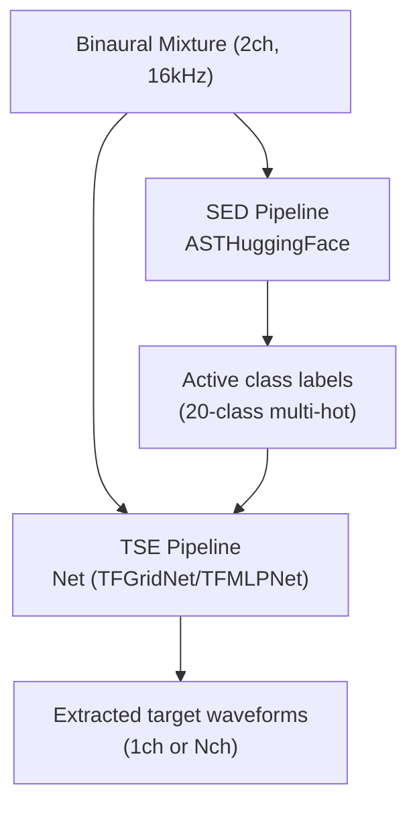
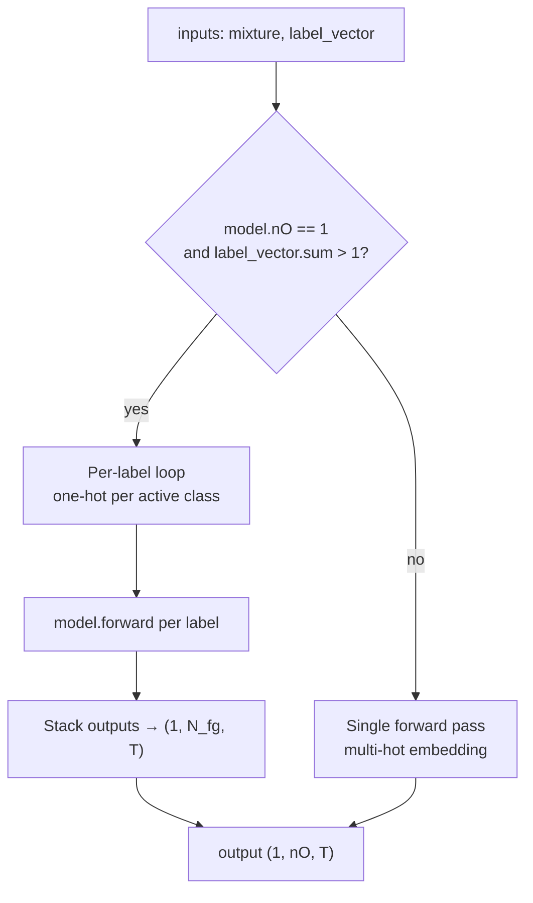
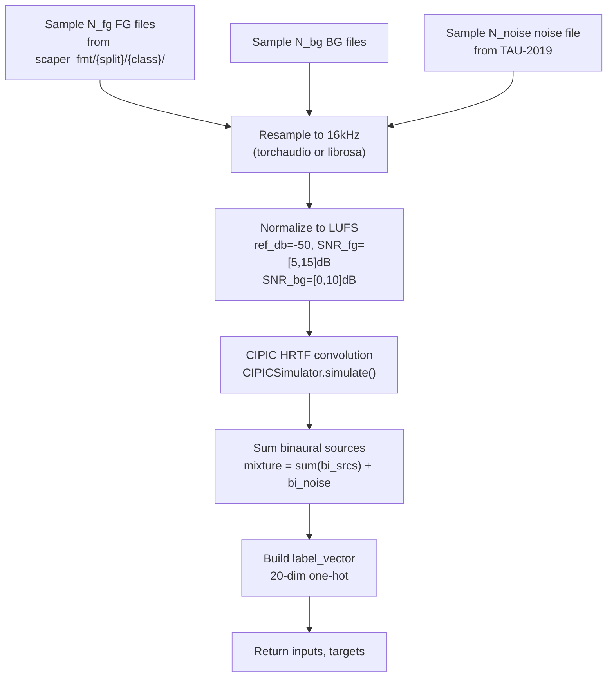
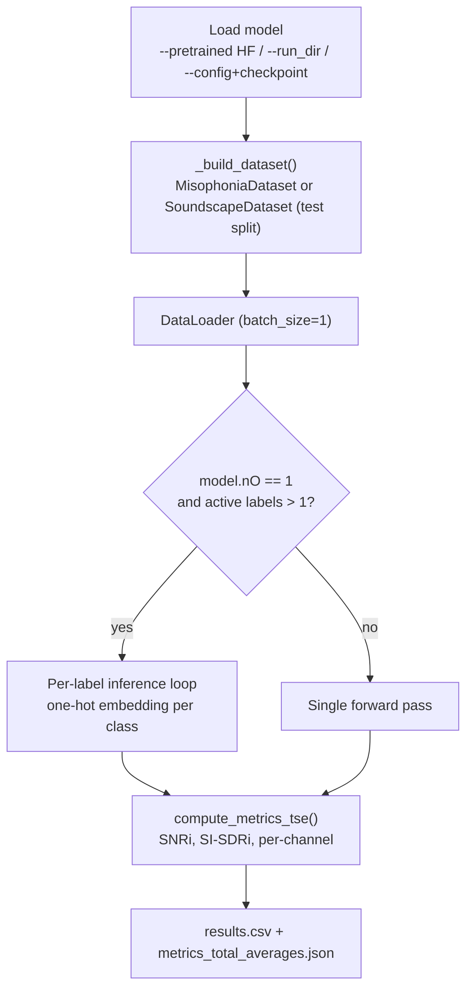
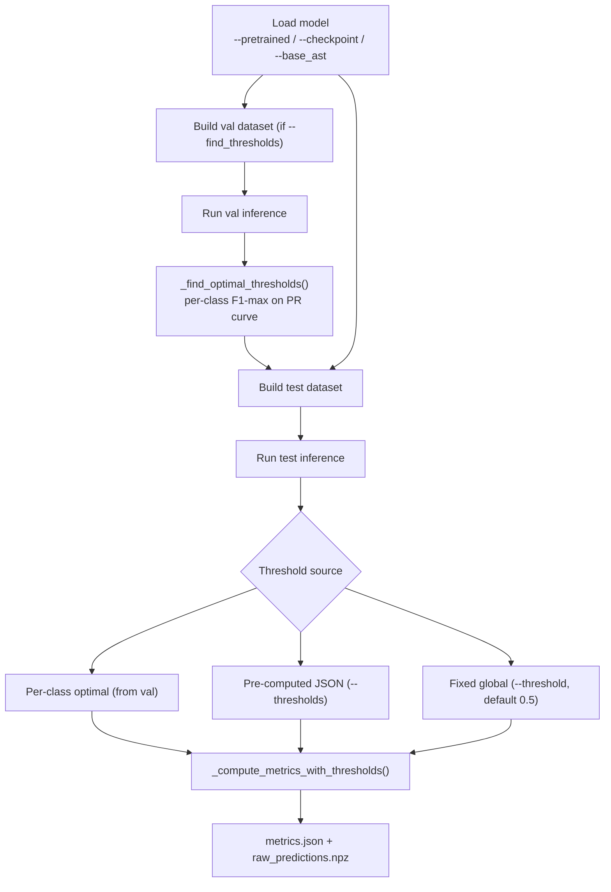
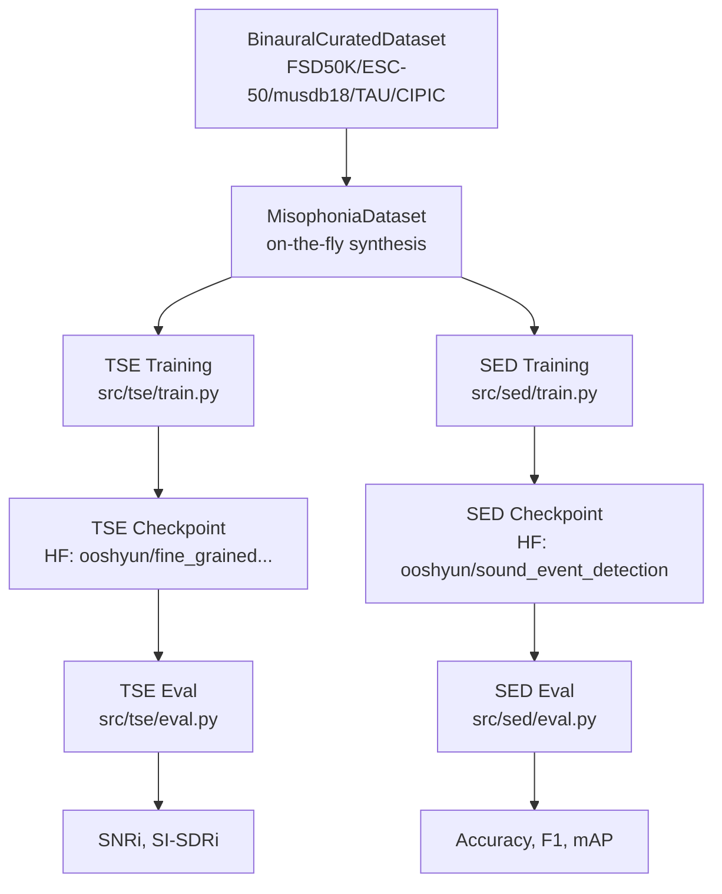
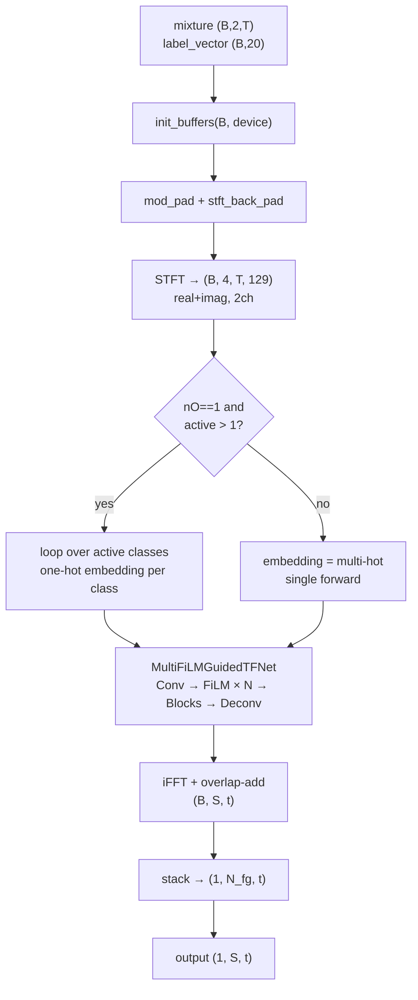
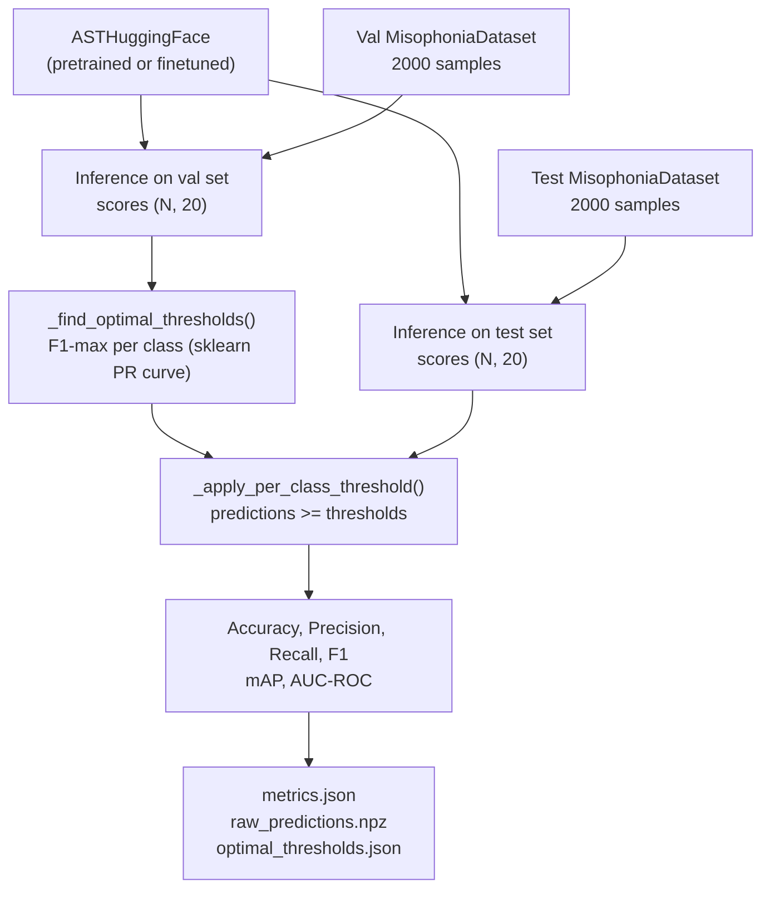
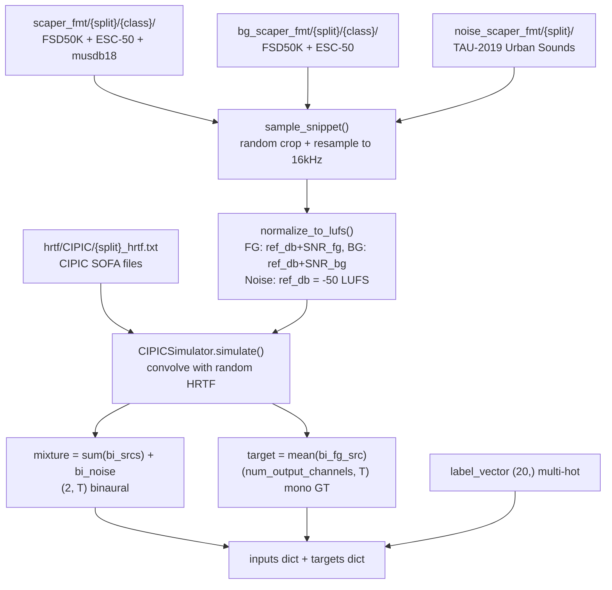

# System Architecture: Fine-Grained Soundscape Control for Augmented Hearing

**Paper**: MobiSys 2026 #198 — arXiv:2603.00395

---

## 1. System Overview

The system consists of two cooperative pipelines:

- **TSE (Target Sound Extraction)**: Separates one or more target sound classes from a binaural mixture using a class-conditioned TF-domain network.
- **SED (Sound Event Detection)**: Classifies active sound events in the mixture using a fine-tuned Audio Spectrogram Transformer (AST).

Both pipelines share the same on-the-fly binaural synthesis dataset and operate on 16 kHz audio.



The SED pipeline detects which sound classes are active. The resulting label vector (20-class one-hot or multi-hot) drives FiLM conditioning in the TSE pipeline to extract the corresponding sources.

---

## 2. TSE Pipeline

### 2.1 Net — STFT Wrapper (`src/tse/net.py`)

`Net` is the top-level module. It wraps an STFT front-end, a `MultiFiLMGuidedTFNet` separator, and an overlap-add iSTFT back-end.

**STFT parameters (paper defaults)**:
- `stft_chunk_size` = 96 samples (6 ms at 16 kHz)
- `stft_back_pad` = 96 samples (6 ms lookback)
- `stft_pad_size` = 64 samples (4 ms lookahead)
- `nfft` = 256 → `nfreqs` = 129

**Public methods**:

| Method | Signature | Description |
|---|---|---|
| `init_buffers` | `(batch_size, device) → dict` | Allocates streaming state (TFNet buffers + iSTFT overlap buffer) |
| `extract_features` | `(B, M, T) → (B, 2M, T, F)` | Windowed STFT, converts to real/imag view |
| `synthesis` | `(B, S, T, CF), state → (B, S, t), state` | iFFT + windowed overlap-add |
| `predict` | `(B, M, t), emb, state → (B, S, t), state` | Full forward: pad → STFT → TFNet → iSTFT → unpad |
| `forward` | `inputs dict → {output, next_state}` | Top-level entry; reads `mixture` and `embedding` from dict |

**Forward data shape trace**:
```
Input:  mixture (B, M, t)  +  embedding (B, 20)
        ↓ mod_pad + STFT
        (B, 2M, T, F)       T = t // chunk_size
        ↓ MultiFiLMGuidedTFNet
        (B, S, T, 2F)
        ↓ iFFT + overlap-add
Output: (B, S, t)
```

### 2.2 MultiFiLMGuidedTFNet (`src/tse/multiflim_guided_tfnet.py`)

FiLM-conditioned separator. Processes TF-domain features through a stack of `GridNetBlock` or `MLPBlock` layers, with `FiLM` modulation injected at configurable positions.

**Architecture layers**:

```
Conv2d(2M → D, 3×3)    # project to latent D
[optional LayerNorm]    # use_first_ln for TF-GridNet
Loop i in range(n_layers):
    [FiLM(D, emb_dim)]  # if i in film_positions
    GridNetBlock / MLPBlock
ConvTranspose2d(D → S×2, 3×3)
reshape → (B, S, T, 2F)
```

**FiLM placement presets**:
- `all`: all layers
- `all_except_first`: layers 1..N-1 (paper default)
- `first`: layer 0 only

**FiLM module (`src/tse/film.py`)**:
```
FiLM(x, emb):  x * Linear(emb) + Linear(emb)
# x: (B, D, T, F),  emb: (B, emb_dim)
```

**Model variants** (from `src/tse/model.py` `_MODEL_NAME_MAP`):

| Friendly name | Block | D | H | B | nO | Target device |
|---|---|---|---|---|---|---|
| `orange_pi` | GridNetBlock | 32 | 64 | 6 | 1 | Orange Pi 5 |
| `raspberry_pi` | GridNetBlock | 16 | 64 | 3 | 1 | Raspberry Pi |
| `neuralaid` | MLPBlock | 32 | 32 | 6 | 1 | NeuralAids/TFMLPNet |
| `waveformer` | DCC-TF | — | — | — | 1 | Baseline |
| `orange_pi_5out` | GridNetBlock | 32 | 64 | 6 | 5 | Multi-output |
| `orange_pi_20out` | GridNetBlock | 32 | 64 | 6 | 20 | Full-class output |

D = latent_dim, H = hidden_dim (block-specific), B = num_layers, nO = num_output_channels.

### 2.3 TSE Inference: 1ch per-label vs. multi-output

The `nO` (num_output_channels) attribute controls which inference path is used at eval time (`src/tse/eval.py`):



**Per-label inference detail (nO=1 models)**:
1. Find active class indices from `label_vector` (20-dim one-hot sum > 1).
2. For each active class index `id_label`, build a one-hot `embedding` with only that class set.
3. Run `model.forward(inputs)` → single extracted waveform.
4. Collect results into output tensor `(1, N_fg, T)`.

**Multi-output inference (nO > 1 models)**:
- Single `model.forward(inputs)` with the full multi-hot `embedding`.
- Returns `(B, nO, T)` directly.

---

## 3. SED Pipeline

### 3.1 ASTHuggingFace (`src/sed/ast_hf.py`)

Wraps `ASTForAudioClassification` from HuggingFace Transformers. Fine-tuned for 20-class sound event detection on top of `MIT/ast-finetuned-audioset-10-10-0.4593`.

**Forward interface**:
```python
inputs = {"mixture": tensor (B, [M], T)}
outputs = model(inputs)
# outputs["output"]     → logits  (B, 20)
# outputs["scores"]     → softmax (B, 20)
# outputs["embeddings"] → CLS token (B, hidden_dim)
```

Multichannel input is mono-downmixed before feature extraction. The HuggingFace `AutoFeatureExtractor` computes log-mel spectrogram features at 16 kHz.

**state_dict delegation**: `ASTHuggingFace.state_dict()` and `load_state_dict()` delegate to the inner `ast_model`, so checkpoints contain only the AST weights.

### 3.2 Pretrained SED Models (`src/sed/model.py`)

| Name | HF subfolder | Description |
|---|---|---|
| `finetuned_ast` | `sed_ast_snr_ctl_v2_16k` | Fine-tuned 20-class AST (paper model) |
| `ast_pretrained` | `MIT/ast-finetuned-audioset-10-10-0.4593` | Baseline 527-class AST |
| `yamnet` | TF Hub | Google YAMNet baseline |

---

## 4. Dataset Pipeline

### 4.1 MisophoniaDataset (`src/datasets/MisophoniaDataset.py`)

On-the-fly binaural synthesis dataset used for both TSE and SED.

**Data sources**:

| Role | Source | Dir layout |
|---|---|---|
| Foreground (FG) | FSD50K + ESC-50 + musdb18 | `scaper_fmt/{split}/{class}/` |
| Background (BG) | FSD50K + ESC-50 | `bg_scaper_fmt/{split}/{class}/` |
| Noise | TAU-2019 Urban Sounds | `noise_scaper_fmt/{split}/` |
| HRTF | CIPIC database | `hrtf/CIPIC/{split}_hrtf.txt` |

**20 sound classes** (alphabetical): alarm_clock, baby_cry, birds_chirping, car_horn, cat, cock_a_doodle_doo, computer_typing, cricket, dog, door_knock, glass_breaking, gunshot, hammer, music, ocean, singing, siren, speech, thunderstorm, toilet_flush.

**`__getitem__` returns**:
```python
inputs = {
    "mixture":      tensor (2, T),         # binaural mixture
    "label_vector": tensor (20,),           # multi-hot FG one-hot
    "fg_labels":    list[str],              # active FG class names
}
targets = {
    "target":       tensor (num_output_channels, T),  # per-source mono GT
    "fg_labels":    list[str],
    "bg_labels":    list[str],
    "noise_labels": str,
}
```

### 4.2 On-the-fly synthesis pipeline



**Level normalization**: Each FG/BG source is normalized via `normalize_to_lufs()` (pyloudnorm, iterative, 0.1 dB tolerance) before spatial rendering. The noise reference is set to `ref_db` = -50 LUFS.

**HRTF types**:
- `CIPIC`: `CIPICSimulator` — single HRTF per speaker, fixed position.
- `MultiCh`: `MultiChSimulator` — random positions; optionally with `CIPICMotionSimulator2` for dynamic motion arcs.

---

## 5. Training Flow

### 5.1 TSE Training (`src/tse/train.py`)

```
YAML config (configs/tse/*.yaml)
    ↓
_build_datasets()       → SoundscapeDataset (train + val)
_build_model()          → Net (TFGridNet / TFMLPNet)
_build_loss()           → MultiResoFuseLoss
    ↓
AdamW optimizer + ReduceLROnPlateau scheduler
    ↓
create_trainer(backend) → Lightning or Fabric trainer
trainer.fit(model, train_loader, val_loader, ...)
    ↓
checkpoints/{best.pt, last.pt}
```

**Loss (`src/tse/loss.py`)**:
```
MultiResoFuseLoss = MultiResolutionSTFTLoss (auraloss) + l1_ratio * L1Loss
```
Default `l1_ratio` = 10. Multi-resolution STFT loss with L1 provides perceptually motivated separation quality.

**Training metrics (inline, not checkpoint criterion)**:
- SI-SDRi: scale-invariant SDR improvement over mixture
- SNRi: SNR improvement over mixture

### 5.2 SED Training (`src/sed/train.py`)

```
YAML config (configs/sed/*.yaml)
    ↓
SoundscapeDataset (task="sed")
    ↓
ASTModel (ASTHuggingFace, freeze_encoder=True by default)
    ↓
Layer-wise AdamW: encoder_lr=1e-5, head_lr=1e-3
CosineAnnealingWarmRestarts scheduler
    ↓
get_loss_function() → BCE or Focal loss
    ↓
create_trainer(backend) → Lightning or Fabric
trainer.fit(...)
```

Fine-tuning strategy: The AST encoder is frozen; only the classification head is trained by default (`unfreeze_layers=["classifier"]`). The head is replaced with a 20-class linear layer using `ignore_mismatched_sizes=True`.

---

## 6. Evaluation Flow

### 6.1 TSE Evaluation (`src/tse/eval.py`)



**Metrics computed**: `snr_i`, `si_sdr`, `si_sdr_i`, `snr_per_channel`, `si_sdr_per_channel`, and mixture-referenced variants.

**Model loading paths**:
1. `--pretrained <repo_id> --model <name>`: Downloads from HuggingFace Hub via `load_pretrained()`.
2. `--run_dir <path>`: Reads `config.json` + `checkpoints/{last,best}.pt` from local run directory.
3. `--config <yaml> --checkpoint <pt>`: Loads YAML config and raw or Lightning checkpoint.

### 6.2 SED Evaluation (`src/sed/eval.py`)



**Threshold strategy**:
- `--find_thresholds`: Runs inference on val set, finds per-class F1-optimal threshold via `precision_recall_curve`, then evaluates test set.
- `--thresholds <json>`: Uses pre-computed per-class thresholds from file (for paper reproduction, `configs/sed/optimal_thresholds.json`).
- Default: fixed threshold 0.5.

**Metrics reported**: Accuracy (per-class mean), macro Precision, Recall, F1, mAP, AUC-ROC.

**Base AST mode (`--base_ast`)**: Loads the pretrained 527-class AudioSet AST, runs softmax, filters to 20 classes via a fixed `_DATASET_TO_AUDIOSET` name mapping. Used as the paper's pretrained-AST baseline.

---

## 7. Key Data Flow Diagrams

### 7.1 Overall system architecture



### 7.2 TSE inference flow (1ch per-label vs. multi-output)



### 7.3 SED evaluation flow (val → threshold → test)



### 7.4 Dataset on-the-fly synthesis pipeline



---

## 8. File Reference Summary

| File | Class / Entry point | Role |
|---|---|---|
| `src/tse/net.py` | `Net` | STFT wrapper, top-level TSE model |
| `src/tse/multiflim_guided_tfnet.py` | `MultiFiLMGuidedTFNet` | FiLM-conditioned TF separator |
| `src/tse/film.py` | `FiLM` | Feature-wise Linear Modulation |
| `src/tse/gridnet_block.py` | `GridNetBlock` | TF-GridNet processing block |
| `src/tse/mlpnet_block.py` | `MLPBlock` | TFMLPNet (lightweight) processing block |
| `src/tse/loss.py` | `MultiResoFuseLoss` | Multi-resolution STFT + L1 loss |
| `src/tse/model.py` | `load_pretrained()` | HuggingFace checkpoint loader for TSE |
| `src/tse/eval.py` | `main()` | TSE evaluation entry point |
| `src/tse/train.py` | `main()` | TSE training entry point |
| `src/sed/ast_hf.py` | `ASTHuggingFace` | AST wrapper (HuggingFace Transformers) |
| `src/sed/model.py` | `load_pretrained()` | HuggingFace checkpoint loader for SED |
| `src/sed/eval.py` | `main()` | SED evaluation entry point |
| `src/sed/train.py` | `main()` | SED training entry point |
| `src/datasets/MisophoniaDataset.py` | `MisophoniaDataset` | On-the-fly binaural synthesis dataset |
| `src/datasets/soundscape_dataset.py` | `SoundscapeDataset` | Refactored dataset (train.py default) |
| `src/datasets/multi_ch_simulator.py` | `CIPICSimulator` | CIPIC HRTF binaural rendering |
| `src/metrics/tse.py` | `compute_metrics_tse` | SNRi, SI-SDRi computation |
| `src/metrics/sed.py` | `ClassificationMetrics` | Accuracy, Precision, Recall, F1 |
| `src/trainer/lightning.py` | `LightningTrainer` | PyTorch Lightning training backend |
| `configs/tse/*.yaml` | — | TSE model and data configuration |
| `configs/sed/*.yaml` | — | SED model and data configuration |
